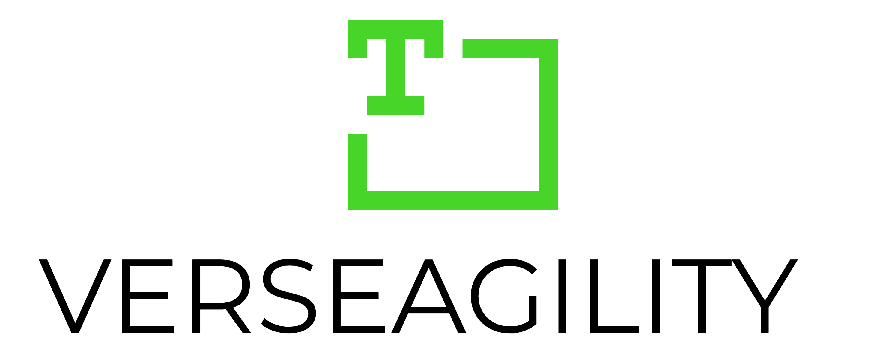

    

# NLP Toolkit

## Supported Use cases
- Binary, multi-class & multi-label classification
- Named entity recognition
- Question answering

## Live Demo
> http://nlp-demo-app.azurewebsites.net/

## Naming
### Azure
> nlp-\<component\>-\<environment\>
### Assets
> \<project name\>(-\<task\>)-\<step\>(-\<environment\>)
- where step in [source, train, deploy], for data assets.
- where task is an int, referring to the parameters, for models.

## TODO
### Project
- [ ] Overview architecture
- [ ] Detailed documentation
### Prepare
- [ ] connect to CosmosDB (pipeline ready)
- [ ] **(IP)** document cracking to standardized format
### Classification
- [ ] **(IP)** Multi label support
- [ ] integrate handling for larger documents
- [ ] dictionaries for business logic
- [ ] integrate handling for unbalanced datasets
- [x] upload best model to AML Model
### NER
- [ ] Improve duplicate handling
- [x] basic custom NER
### Rank
- [ ] **(IP)** Improve answer quality
### Deployment
- [x] Param script for deploy
- [ ] Deploy to Azure Function (without AzureML)
### Notebooks
- [x] review prepared data
- [ ] **(IP)** review model results (auto generate after each training step)
- [ ] review model bias (auto generate after each training step)
- [ ] available models benchmark (incl AutoML)
### Tests
- [ ] **(IP)** integrate testing framework (pytest)
- [ ] automated benchmarks
### New Features (TBD)
- Summarization
- Deployable feedback loop
- Integration with GitHub Actions

# Acknowledgements
Verseagility is built in part using the following:
- [Transformers](https://github.com/huggingface/pytorch-transformers) by HuggingFace
- [FARM](https://github.com/deepset-ai/FARM/) by deepset ai
- [spaCy](https://github.com/explosion/spaCy/) by Explosion ai
- [flair](https://github.com/flairNLP/flair/) by Zalando Research
- [gensim](https://radimrehurek.com/gensim/)

# Contributing
This project welcomes contributions and suggestions.  Most contributions require you to agree to a
Contributor License Agreement (CLA) declaring that you have the right to, and actually do, grant us
the rights to use your contribution. For details, visit https://cla.opensource.microsoft.com.

When you submit a pull request, a CLA bot will automatically determine whether you need to provide
a CLA and decorate the PR appropriately (e.g., status check, comment). Simply follow the instructions
provided by the bot. You will only need to do this once across all repos using our CLA.

This project has adopted the [Microsoft Open Source Code of Conduct](https://opensource.microsoft.com/codeofconduct/).
For more information see the [Code of Conduct FAQ](https://opensource.microsoft.com/codeofconduct/faq/) or
contact [opencode@microsoft.com](mailto:opencode@microsoft.com) with any additional questions or comments.
