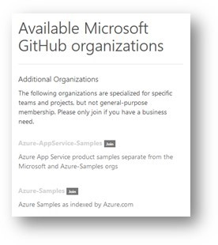

# Frequently Asked Questions
This section covers frequently asked questions and will grow over time. We appreciate your feedback to continuously improve our toolkit and let it grow over time!

### How do I join the Microsoft organization on GitHub?
This documentation helps you to connect your personal GitHub with the Microsoft organization. You will be able to access Microsoft-internal GitHub repositories after successfully connecting them.

1. Enable 2-factor authentication on your GitHub account ([Instructions](https://help.github.com/en/github/authenticating-to-github/configuring-two-factor-authentication#configuring-two-factor-authentication-using-text-messages)). You can either use SMS or app authentication. We recommend using App-Authentication, either with Microsoft Authenticator on your corporate phone or using [LastPass Authenticator](https://lastpass.com/auth/),  as SMS can be difficult when you are abroad. Other apps are also possible, but LastPass Authenticator is the only app that works without login.
2. Save the reset codes to be able to reset the 2-factor authentication one day.
3. [Here](https://repos.opensource.microsoft.com/) you can link your GitHub account to the Microsoft organization afterwards. You have to give Microsoft the authorization to access your GitHub (e.g. Microsoft will ask you if your GitHub account uses 2-factor authentication).
4. After successfully linking the accounts, you can join the GitHub organization "microsoft" in the "Available Microsoft GitHub organizations" section. 

5. Your GitHub profile should now list "microsoft" among your organizations. 

6. You can now access the [Verseagility GitHub-repository](https://github.com/microsoft/verseagility)

### How to add support for a new languages?
The following adjustments need to be made, based on the task types that should be supported.

1. __Language model extensions__
- All
  - Check if the spacy multi-lingual models supports your language
  - If it is not supported, or you want a language specific model, add the applicable model to the `spacy_model_lookup` object in `/code/helper.py`
- Classification
  - Check if the DL architecture you want to us supports your language in their pre-trained multi-language models. Check [here](https://huggingface.co/transformers/pretrained_models.html) for details.
  - If it is not supported, or you want a language specific model, add the applicable model to the `farm_model_lookup` object, in `/code/helper.py`
- NER
  - Check if flair multi-language ner model supports your language
  - In addition, you can train your own NER using one of the models used for the sequence classification task
- QA
  - Currently, the QA model is language agnostic. The pre-processing steps (incl. stopwords and tokenization) should be optimized on a per-language basis

2. __Tokenizer adjustments__ 
The Spacy tokenizer is used for splitting words and characters into tokens. See the spacy model support above, for appropriate approaches to language specific tokenization. This includes lemmatization and stemming (if needed). A stopword list can be added for the respective language, by adding a utf-8 encoded list of stopwords in a `.txt` file to the /assets folder. The naming is as follows: `stopwords-{language}.txt`. Examples for German and French are given.
