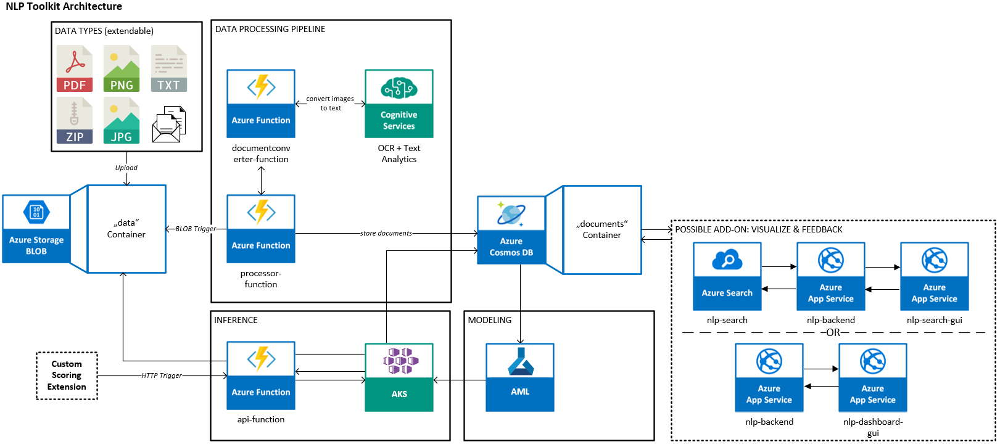

# Verseagility NLP Toolkit

[**Verseagility**](https://github.com/microsoft/verseagility) is a Python-based toolkit for your custom Natural Language Processing (NLP) projects, covering following tasks:
- Classification
- Named Entity Recognition (NER)
- Question-Answering (QA, suggestion of possible answers for the input text)

This documentation helps you to get started with the toolkit from infrastructure setup over training to deployment of your custom demo.

1. [Requirements](#requirements)
1. [Software Architecture](#software-architecture)
1. [Verseagility-Setup](#verseagility-setup)
1. [Demo-Setup](#demo-setup)
1. [Code Repository](#code-repository)
1. [Questions / FAQ / Problems / Contact](#questions-/-faq-/-problems-/-contact)

## Requirements
[**Verseagility**](https://github.com/microsoft/verseagility) targets (product and field) data scientists, program managers and architects working within the field of NLP. Nevertheless, everyone who is interested in the field of NLP and can be deployed with no changes in the code. You will enjoy the most if you already bring some previous knowledge:
* [x] Foundational proficiency in Python
* [x] Understand the key principles of NLP tasks
* [x] Experience in Azure Machine Learning

Following technical framework is recommended and will help you to succeed:
* [x] an [Azure](https://portal.azure.com) subscription (including GPU-quota if you want to train your own models)
* [x] Python 3.7 and Virtual Environments
* [ ] [VSCode](https://code.visualstudio.com/docs/?dv=win) (recommended)
  - alternatively, you can also run the scripts using PowerShell

## Software Architecture
The toolkit is based on the following architecture. Basically, it is possible to run the toolkit locally to train models and create assets, yet we highly recommend you to use the Microsoft Azure ecosystem to leverage the full functionality and provisioning as a cloud service.

## Verseagility-Setup
The step-by-step approach for getting started with the NLP toolkit can be found [here](setup/). It helps you to set up your environment, guides you through the training process and gives you some advice for potential customizations.

## Demo-Setup
A demo resulting from the toolkit deployment can be found here:
> https://verseagility.azurewebsites.net

The intended purpose is illustrated using [Microsoft Forum](https://answers.microsoft.com) data in English, German, Italian, Spanish and French. More languages might follow over time.

Verseagility also allows you to set up your own personal demo WebApp on Azure. This can be done with your logo/that of your customer or end-to-end with your own data. The different approaches are described [here](docs/01 - Demo Environment Setup.md).

## Code Repository
The code and detailed instructions can be found on the [Verseagility](https://github.com/microsoft/verseagility) GitHub repository. In case you cannot access the repository, you first have to join the Microsoft GitHub organization. You will find instructions on the [FAQ page](FAQ.md). See the repository for latest features, work in progress and open todo's. **Feel free to contribute!**

## Questions / FAQ / Problems / Contact
Feel free to create an issue or pull request in GitHub if you find a bug, have a feature request or a questions.
Alternatively, feel free to reach out to the main contributors to this project:
- [Timm Walz](mailto:timm.walz@microsoft.com)
- [Martin Kayser](https://github.com/maknotavailable)
- [Christian Vorhemus](mailto:christian.vorhemus@microsoft.com)

Also, see our [FAQ page](FAQ.md) which is going to be continuously extended.
