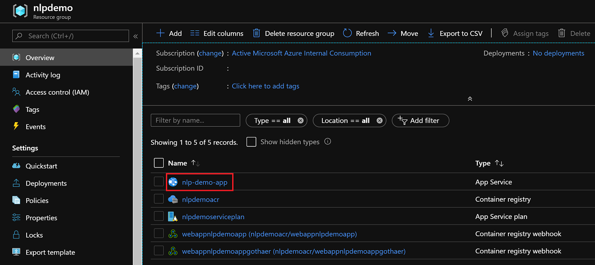
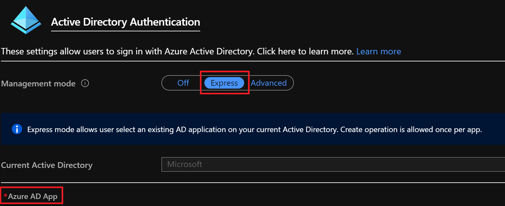
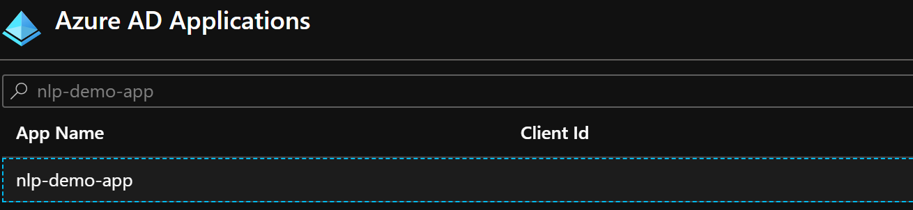
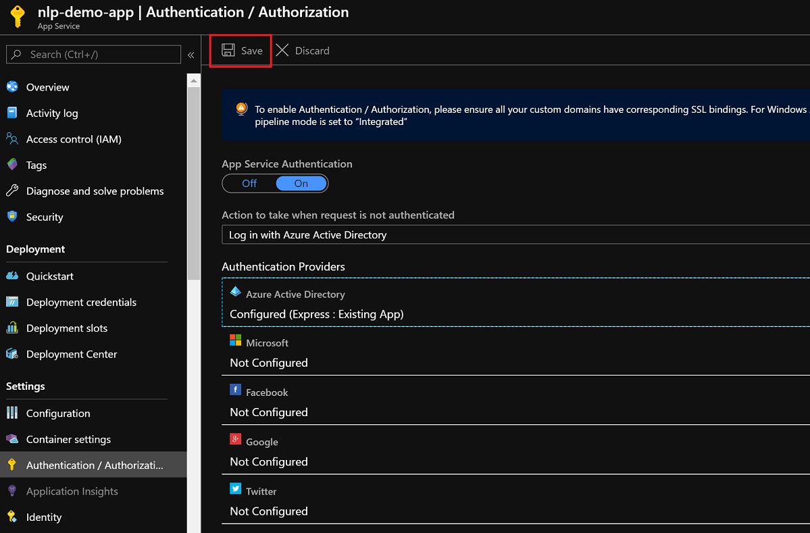
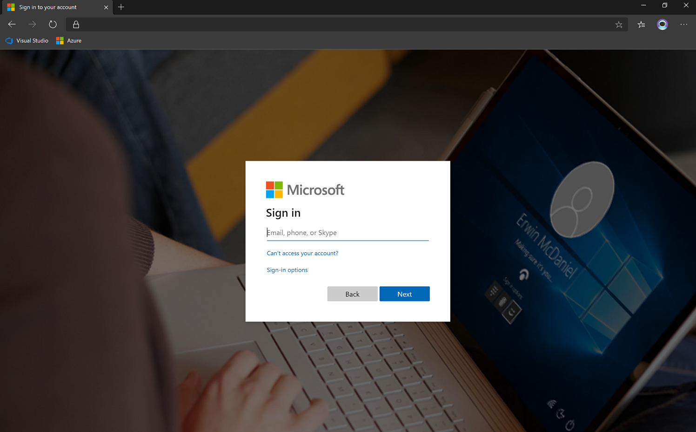

# Setup of your Demo WebApp
This documentation helps you to deploy your own demo for the Verseagility-toolkit to an Azure WebApp.


## Approaches
There are different approaches of possible demo environment setups.
#### Dashboard - Basic
- Deploy the dashboard with your custom logo in your own subscription
- Use already trained and deployed models based on Microsoft forum data, so no pipeline deployment and training steps)
- Enable a personal brand experience for your customer with little effort
- Steps to be followed:
  - [General Setup](#general-setup)
  - [Dashboard Customization](#dashboard-customization)
  - [AAD Authentication](#activate-azure-aad-authentication-for-your-demo) (recommended)

#### Dashboard - Advanced
- Deploy the whole toolkit end-to-end in your own subscription, _including_ pipeline setup and training (you need own data)
- Enable a domain-specific experience for your customer with medium effort
- Steps to be followed:
  - [General Setup](#general-setup)
  - [Set the Endpoint Keys](#set-the-endpoint-keys)
  - [AAD Authentication](#activate-azure-aad-authentication-for-your-demo) (recommended)


#### Dashboard - Premium
- Deploy the whole toolkit end-to-end in your own subscription, _including_ pipeline setup and training
- Deploy the dashboard with your custom logo in your own subscription
- Enable a domain-specific and personal brand experience for your customer with medium effort
- Steps to be followed:
  - [General Setup](#general-setup)
  - [Dashboard Customization](#dashboard-customization)
  - [Set the Endpoint Keys](#set-the-endpoint-keys)
  - [AAD Authentication](#activate-azure-aad-authentication-for-your-demo) (recommended)

## General Setup
1. Start a command line of your choice (we recommend you to use PowerShell, ideally start it as admin).

2.	Clone the repository to your local drive or download it as zip archive and extract it:<br> `git clone https://github.com/microsoft/verseagility`.

## Dashboard Customization
This section is only required if you follow the _Dashboard - Basic_ or _Dashboard - Premium_ track. If you follow the _Dashboard - Advanced_ track, you can skip it.
1.	Navigate to the `demo`-subfolder and add your custom logo by replacing the active logo file `logo.PNG`. Alternatively, you can change the value in the code and use any other file name in `demo/dashboard.py`.

2. Change any other structural or text elements in `demo/dashboard.py`. If you want to go deep into the customization, we recommend you the official documentation platform of [Streamlit](https://docs.streamlit.io/en/stable/api.html). Your ideas and contributions to our demo are highly appreciated!

## Set Languages and Endpoint Keys
This section is only required if you follow the _Dashboard - Advanced_ or _Dashboard - Premium_ track. For an end-to-end custom solution based on your own data, first follow the instructions which you find on this part of the documentation: [Verseagility Setup](../setup).

Next, open the script `demo/load_examples.py` and adjust the following parts as needed (depending on whether you build a multi-language demo):
- `get_languages()`
  - dictionary of languages in the structure of `"language": "language-code"`, e.g. `"German": "de"`
- `get_endpoints()` 
  - load endpoints from App Settings
  - ```python
    MODEL_ENDPOINTS = {
        'en': 'http://[YOUR URL GOES HERE].azurecontainer.io/score'
    }

    ENDPOINT_KEY = {
        'en': '[YOUR ENDPOINT KEY GOES HERE]'
    }
    ```
- `get_examples()`
  - definition of a few examples as needed, consisting of `DEFAULT_SUBJECT`, `DEFAULT_TEXT`
Once these are completed, [take the endpoints with the respective keys](../setup/06%20-%20Deployment.md) 


Save your changes and continue with the next section of this page for dashboard deployment.

## Dashboard Deployment
This section helps you to deploy the demo to your own subscription.
1. Start a command line of your choice (we recommend you to use PowerShell, ideally start it as admin).

2. Login to your Azure subscription: `az login`.

3. Change directory to the demo-root directory (`demo/` in the repository).

4. Open the file `deploy.ps1` with a text editor of your choice in the edit mode.

5. Set your custom parameters for every variable and save your changes. We recommend you to use `northeurope` or `westeurope`, as there is no Linux-based app service available in `southcentralus`, based on our test deployment. Basically, you can take these as they are with exception of `$acr` and `$app`, as they have to be globally unique.
```csharp
# Params
$location = 'westeurope'
$rg = 'nlpdemo'
$acr = 'nlpdemoacr'
$image =  'nlp-demo-image'
$sp = 'nlpdemoserviceplan'
$app = 'nlp-demo-app'
$url = $acr + '.azurecr.io/' + $image + ':latest'
$create = $TRUE
```
For updating purpose after your first deployment, change `$create` to `$FALSE`.

6. Initiate the deployment process by executing the command `.\deploy.ps1` and wait until it is finished.

## Activate Azure AAD Authentication for your demo
In order to protect your demo website from external users and to avoid misuse, we recommend you to activate an Azure Active Directory (AAD) authentication. The following steps help you to register your WebApp in the AAD you are working in. Authentication methods like a public Microsoft/Outlook.com-account also work, in case you want to make it useable for a client.

1. Go to your resource group where you have just deployed the demo app and enter the App Service resource. In this case, we click on "_nlp-demo-app_".


2. Click on _"Authentication / Authorization"_ on the left menu.

3. Set _"App Service Authentication"_ to _"On"_.

4. For the dropdown _"Action to take when request is not authenticated"_, choose the option _"Log in with Azure Active Directory"_.

5. Click on _"Azure Active Directory"_ below to enter the configuration environment.

6. Select _"Express"_ and click on _"Azure AD App"_ to search for your application.


7. Search for your app name, choose the respective result and click _"OK"_.

8. Back on the previous page of (6), click _"OK"_ again.

9. You should now be back at the starting point where your configuration should look like the one you see below. Click _"Save"_ to confirm your settings. 

10. After couple of minutes, when accessing your web demo, you should now be redirected to an AAD login page. 
