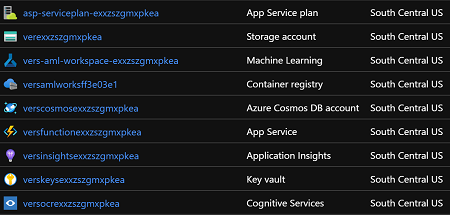
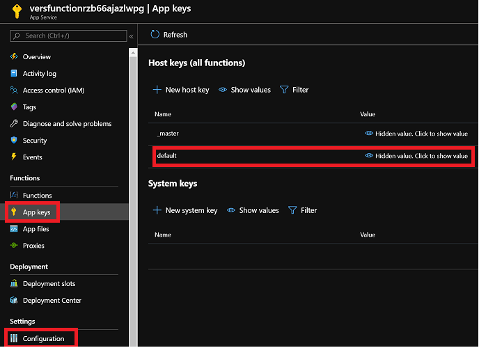

# Environment Setup
This documentation helps you to clone the repository to your local machine, install the environment and deploy all the necessary resources to your Azure subscription using an ARM-template. Therefore, the manual effort is minimized and the integrity is ensured.

## Repository Setup
0. Make sure you fulfill all criteria described in the [requirements](../README.md#requirements) section.

1. Start a command line of your choice (we recommend you to use PowerShell or VSCode) and navigate to the local folder where you would like to clone the repository into.

2. Clone the repository to your local drive or download it as zip archive and extract it:
  ```
  git clone https://github.com/microsoft/verseagility
  ```

3. `cd` into the root directory of the cloned repository (`cd verseagility/`) and set up a virtual environment. If the virtual environment extension is not installed in your Python version, first run the following command:
```
pip install --user virtualenv
```

4. To create the virtual environment, run the command below. This is going to take a couple of seconds.
  ```
  python -m venv .venv
  ```

5. After setting up the virtual environment, activate it using the command below.

  Windows:
  ```
  .venv/Scripts/activate
  ```

  Linux:
  ```
  source .venv/bin/activate
  ```


6. To deactivate the `venv`, just type `deactivate` in your command line. Make sure other environments, such as Conda, are deactivated before going ahead. You may recognize eventually activated Conda environments in the beginning of the line, stating `(base)`. In that case, type `conda deactivate`.

7. Next, we install the requirements with help of the `requirements.txt` file. This may take a couple of minutes.
```
pip install -r requirements.txt --find-links https://download.pytorch.org/whl/torch_stable.html
```

8. You can now go ahead with the deployment of the Azure resources. Follow the instructions in [Deploy to Azure](#deploy-to-azure). Alternatively, go to [Local development (optional)](#local-development-optional)

## Deploy to Azure
1. Basically, you can choose an arbitrary Azure region where the resources should be deployed. The end-to-end deployments have successfully been tested for _South Central US_, _West Europe_ and _North Europe_, which is why we would recommend you to choose among these. Click on the button below to start the resource deployment:<br>
[](https://portal.azure.com/#create/Microsoft.Template/uri/https%3A%2F%2Fraw.githubusercontent.com%2Fmicrosoft%2Fverseagility%2Fmain%2Fpipeline%2Finfrastructure%2Fazuredeploy.json)

   In the "Instance Details" section, you might want to enter predefined names for the resources that will be created. If you do not enter a value, the resources will get assigned a name that is composed of the resource type and a unique string calculated with the help of your resource group id.

2. Make sure you wait until all resources have been deployed successfully before you proceed with the next step. You can verify this by checking the notification bell at the top menu whether any errors occurred. The resource group should have the following components:

      - [Azure Machine Learning](https://azure.microsoft.com/en-us/services/machine-learning/)
        - Accelerator for Machine Learning projects
        - Central component for model training and deployments
      - [Azure Function](https://azure.microsoft.com/en-us/services/functions/)
        - Data pipeline component for automatically adding data from the BLOB-entrypoint into the CosmosDB
      - [Application Insights](https://docs.microsoft.com/en-us/azure/azure-monitor/app/app-insights-overview)
        - Insights into the Azure Function application
      - [App Service Plan](https://docs.microsoft.com/en-us/azure/app-service/overview-hosting-plans)
        - Hosting for Azure Function, deployed along with the respective Function
      - [Container registry](https://azure.microsoft.com/en-us/services/container-registry/)
        - Registration component for deployed models and endpoints
      - [Cosmos DB](https://azure.microsoft.com/en-us/services/cosmos-db/)
        - Managed database providing input data for the Azure Machine Learning Service
      - [Cognitive Services](https://azure.microsoft.com/en-us/services/cognitive-services/)
        - Intelligent API for OCR and Text Analytics services
      - [Key Vault](https://azure.microsoft.com/en-us/services/key-vault/)
        - Safeguard cryptographic keys and other secrets used by cloud apps and services
      - [Storage account](https://docs.microsoft.com/en-us/azure/storage/common/storage-account-overview)
        - Central file storage for data input, prepared Azure Machine learning data etc.)

3. After the deployment has finished (approx. 30 minutes) as a workaround for now, you have to add the Function host key as an environment variable manually. Therefore, access your Function App, click on "_App keys_" in the left menu, click on "_default_" and copy the key from the menu which is going to appear on the right hand side. After copying, click on  "_Configuration_" and insert the key in the field named "_FunctionHostKey_" in the function (if the variable is already there, replace the value) and click "_Save_".<br>


4. You may now proceed with the data preparation pipeline [here](02%20-%20Data%20Preparation%20Pipeline.md).

## Local development (optional)
Instead of working in an Azure subscription with help of the resources deployed in the step before, you can also work locally. Yet, we recommend you to use the cloud infrastructure to get the best experience possible.

0) Make sure you fulfill all the requirements as stated [here](https://docs.microsoft.com/en-us/azure/azure-functions/functions-create-first-function-vs-code?pivots=programming-language-csharp) and in the [README-document](../README.md#requirements).

2) Change directory of your local repository to `pipeline/functions`.

3) Install the node dependencies
  ```
  npm install
  ```

3) Install the Azure Function extensions
  ```
  func extensions install
  ```

5) If you debug locally, create a file `local.settings.json` in the same directory as folders `api` and `blob-trigger` and add the following values:
  ```
  {
    "IsEncrypted": false,
    "Values": {
      "AzureWebJobsStorage": "<AzureStorageConnectionstring>",
      "CosmosDBConnectionString": "<CosmosDBConnectionstring>",
      "FUNCTIONS_WORKER_RUNTIME": "node",
      "CognitiveServiceKey": "<OCRServiceKey>",
      "CognitiveServiceName": "<OCRServiceName>"
    }
  }
  ```

6) Start the function host
  ```
  func start
  ```