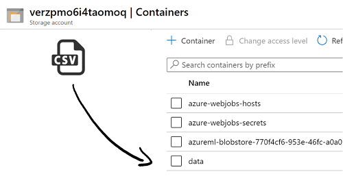
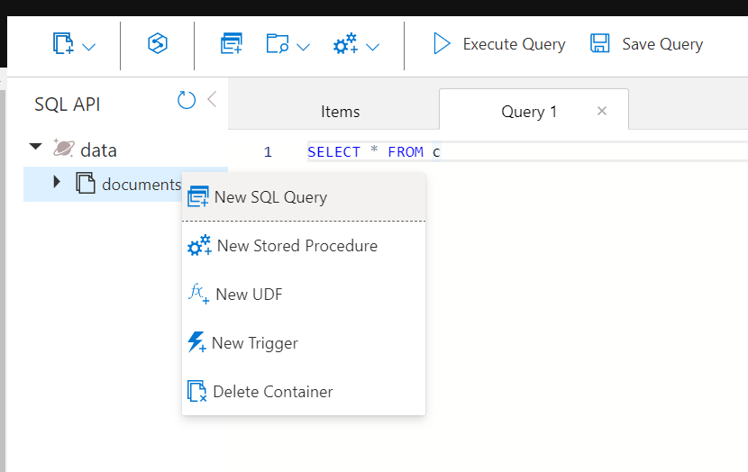
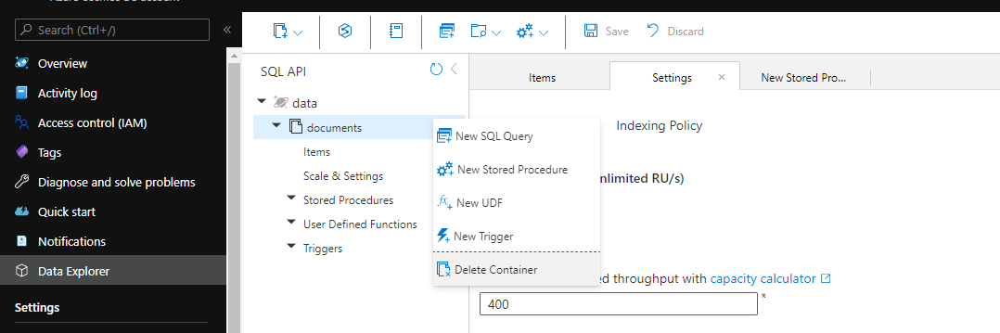
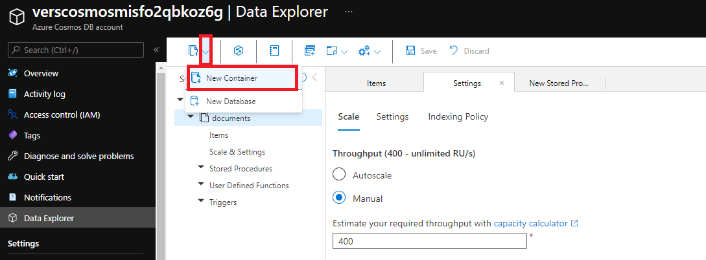
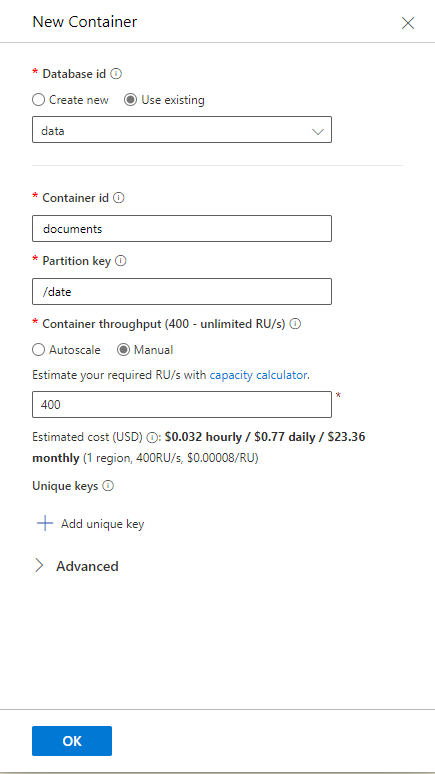

# Data Preparation Pipeline
This documentation helps you to understand the data preparation pipeline, how to bring your own data into the system and describes the required file structure.

## Data Processing

The purpose of the pipeline is twofold: 
1. It automatically processes supported documents that are put into the `data` container of the created Azure Storage
2. It creates a REST endpoint that can be used to convert documents (such as images, PDFs) into text.

Follow the steps below to bring your documents to the right place:
1. If you put files in the storage account `data` container, the files are processed and put in Cosmos DB following the standardized output format. For testing purpose you may use this tab-delimited [Sample CSV-file](../.attachments/sample.csv) or a [Sample JSON-file](../.attachments/sample.json). 

  ---
  **NOTE**

  - In case you want to transform your data, e.g. from a pandas data frame into a structured JSON, the [data preparation notebook](../../notebook/Data%20-%20Transform%20Dataframe%20to%20JSON.ipynb) might be helpful for you. Have a look at the standard JSON structure supported by Verseagility.
  - For training data corpora larger than 10,000 documents, we recommend to upload them chunk-wise to the BLOB-storage, otherwise it might come to bottlenecks in the document processor function. This [data preparation notebook](../../notebook/Data%20-%20Transform%20Dataframe%20to%20JSON.ipynb) might be helpful in that case as well.

  ---


```json
[{
    "question": {
        "title": "Any way to force the August 3 updates to the SP4 after the Win10 Anniversary Update?",
        "author": "Ed Hansberry (work acct)",
        "createdAt": "Created on August 5, 2016",
        "text": "There is a big warning/alert in this forum to apply the August 3 Surface Pro 4 updates after upgrading to the Windows 10 Anniversary update.I updated to that yesterday, but I continue to check Windows Updates and it says there is nothing available, other than the occasoinal Windows Defender updates.Any ideas how to force it? Kind of frustrating they are throttling the update on the one hand and telling you to apply it as soon as you upgrade on the other.",
        "upvotes": 1
    },
    "id": "49f70573ff76458f823b605d88798c18",
    "views": 39,
    "appliesTo": "Surface,Surface Pro 4,Install, update, and repair",
    "url": "https://answers.microsoft.com/en-us/surface/forum/all/any-way-to-force-the-august-3-updates-to-the-sp4/f2758bea-38b8-476b-9017-1b9017b4970d",
    "language": "en-us",
    "answer": {
        "markedAsAnswer": "false",
        "createdAt": "Replied on August 5, 2016",
        "text": "Go to http://www.microsoft.com/en-us/download/details.aspx?id=49498 and download and run the latest MSI then restart.",
        "upvotes": 0
    }
}]
```



What happens in the background is that the `processor-function` gets triggered. This function takes the newly added blob and parses it based on the content/MIME-type of the blob. To tell the function how a certain document has to be handled, you must write your own parser, parsers are stored in the /parsers directory. By default, three parsers are already implemented (CSV, JSON and default). If you take a look at e.g. csv-parser, you see that the job of the parser is to map content of the CSV file to an object called `OutputSchema`. OutputSchema is the document schema that will be used to store the document in Cosmos DB (of course you can also adopt the schema to fit your needs). For example, if your CSV file contains a list of documents and the ID in the first column (index 0), the number of views for this document in the second column and the URI to the document in the third column, the parser iterates over all rows and maps all columns to the right `OutputSchema` properties:


Note: If you want to link attachments to the documents in the CSV file, create a container in the storage account named after the document ID. The pre-implemented parser will search in the storage for any container that has the same ID as the document. If it finds one, it links all blobs in the container as attachments to the document.

2. If no matching parser is implemented, the default-parser will be used. It forwards the document to another function called "documentconverter-function". The document converter can also be called manually by performing the following HTTP request:
`POST https://myfunctionapp.azurewebsites.net/documentconverter?code=[function-key]`
The content of the HTTP request is of type application/json and is a single object containing the properties "name" (the name of the document), "content" (the binary file encoded as base64 string) and "contentType" (MIME-Type). It may look like this:
```javascript
{
  "name": "sample.pdf",
  "content": "JVBERi0xLjUKJY8KOCAwIG9iag[...]",
  "contentType": "application/pdf"
}
```

The job of the document converter-function is to return an XML document containing the textual representation of the binary file. If the passed file is a PDF, the text of the PDF is returned (embedded in an XML structure). If the file is an image, OCR will be performed and the result is returned.

3. If you want to store documents for scoring, the "api-function" can be used. It accepts "application/json" HTTP requests and stores the documents described in the HTTP body in Cosmos DB following the "OutputSchema". It also parses linked attachments that are stored in the storage account that was created during deployment. You can call the API by using
`POST https://myfunctionapp.azurewebsites.net/api/score?code=[function-key]`

The HTTP request body may look like this
```javascript
{
  "subject": "Document subject",
  "body": "Document content and text",
  "attachments": [
    {
      "link": "https://mystorageaccount.blob.core.windows.net/attachments/sample.pdf"
    }
  ]
}
```

The function will parse `sample.pdf` and add the content of the PDF as well as the other properties (subject and body in this case) to the Cosmos DB collection.

## Helpful Hints
### Count Documents in Cosmos DB
If you would like to count the amount of documents in your container, click on the `...` next to the container name, select _New SQL Query_ and type your commands depending on your desired filter in the following structure:
- `SELECT VALUE COUNT(1) FROM c` -> counts all documents
- `SELECT VALUE COUNT(1) FROM c WHERE c.language = "en-en"` -> counts documents in `en-en` only


### Delete CosmosDB Container
In case you would like to delete old data from the CosmosDB, we recommend you to remove the entire container. Open your CosmosDB-resource in the Azure Portal and follow the steps below.

1. Select the container `documents` to be deleted by clicking the `...` next to the container name. Next, smash _Delete Container_. Caution: all data will be gone from the CosmosDB after removing the container!<br>


1. Next, choose the dropdown menu as shown in the image below and click _New Container_.<br>


1. Fill in the information as shown in the screenshot. It is important that you take over these values, as the document processing pipeline might no longer work if the values differ. You may define the container throughput as needed, depending on your desired level of scale. Click _OK_ to create the new container.<br>
