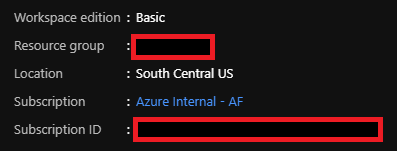
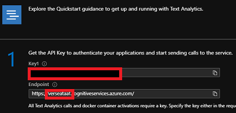
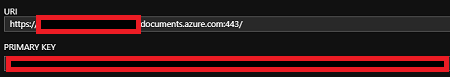

# Project Setup
This page describes how you get and set the right Azure resource keys to make Verseagility work end-to-end.

## Grab your Keys
1. In the root directory of the Verseagility repository, you will find a file named `config.sample.ini`, which has the following content:

  ```
  [environ]
  aml-ws-name=
  aml-ws-sid=
  aml-ws-rg=
  text-analytics-name=
  text-analytics-key=
  cosmos-db-name=
  cosmos-db-key=
  ```

2. Create a copy of this file and name it `config.ini`. Store it in the same folder as the `config.sample.ini`

3. Go to your newly created resource group in your [Azure portal](https://portal.azure.com) and enter following resources one after another:
  - __Azure Machine Learning__
    - The main page of Azure Machine Learning has all the information you need, starting with the name of your resource, which you have to insert in the `aml-ws-name`.
    - Secondly, you have to insert your subscription ID as stated in the screenshot below in the second row `aml-ws-sid`.
    - Also, you have to insert the name of your resource group in the line `aml-ws-rg`.
    - 

  - __Text Analytics Service__
    - At the main page called _Quick start_, copy the following elements:
    - Copy  _Key1_ and insert it in the `text-analytics-key` row of your `ini`-file.
    - Mark and copy the  _Endpoint_ name of the text analytics service as stated in the frame and insert it in the `text-analytics-name` of your file. You do not need the whole URL, the name is sufficient.
    - Please verify with the icon you see below that you are actually using the Text Analytics resource instead of the Computer Vision.

    - 
  - __Cosmos DB__
    - After entering your _Cosmos DB_ resource, click on _Keys_ in the left menu.
    - From there, copy the resource name from the _URI_-field, which matches to the name of the resource. Similarly to the _Text Analytics Service_, you do not need the entire URL, the name is sufficient. Insert it in the `cosmos-db-name` of your file.
    - Last but not least, copy the _Primary Key_ and set it in the `cosmos-db-key` row.
    - 

4. Your file should look similarly to this one (the values below are random):
  ```
  [environ]
  aml-ws-name=vers-aml-workspace-ikkavgc641vq2
  aml-ws-sid=1dca2144-0815-3301-b6a5-8a97ef7632a5
  aml-ws-rg=verseagility
  text-analytics-name=verstaxhksd72s
  text-analytics-key=9b82deffedca46bd9b4938cd8029a355
  cosmos-db-name=verscosmosiqkkxah120vq2
  cosmos-db-key=XH0mse9II5wYaXJMFb5sycyDcaAWwATwJTAdvVhBD18QdQaYsZe23mupgD378VZW751yHP6v4YbOZitgxSXSg==
  ```

## Project file

1. Create a config file for your end-to-end Verseagility-project in the subfolder _project/_ (located in the root folder of the repository). We recommend you to follow this naming convention:
`[name of your project]\_[language code, two letters].config.json` -> `msforum_en.config.json` <br>
See the following json-snippet as an example:
```json
{
    "name":"msforum_en",
    "language": "en",
    "environment" : "dev",
    "data_dir" : "./run/",
    "prepare" : {
        "data_type" : "json"
    },
    "tasks": {
        "1": {
            "label": "subcat",
            "type": "classification",
            "model_type": "roberta",
            "max_seq_len": 256,
            "embeds_dropout":0.3,
            "learning_rate":3e-5,
            "prepare": true
        },
        "3": {
            "type": "ner",
            "prepare": false
        },
        "4": {
            "type": "qa",
            "model_type": "historical",
            "prepare": true
        }
    },
        "deploy": {
            "type": "ACI",
            "memory": 2,
            "cpu": 1
        }
}
```
You see that there are multiple task levels. If you only want to go for classification, keep task level 1 in mind. In case you do not want to integrate Named Entity Recognition and Question/Answering, simply remove it from your JSON.

2. After creating the json file, you need to do a slight change in the `custom.py` script:
  - Look for this line within the script: <br>
  ```python
  params = he.get_project_config('[INSERT CONFIG NAME HERE]')
  ```
  - Insert the file name of the JSON (e.g. `msforum_en.config.json`) you just created in the first step of this section. You do not need to pass a folder name as long as the file is located in `project/`, which we highly recommend. The line of your code should look like this:
  ```python
  params = he.get_project_config('msforum_en.config.json')
  ```

Your project is now set up!