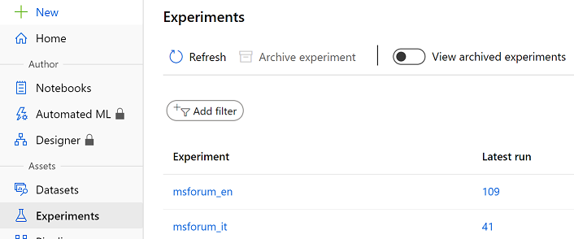
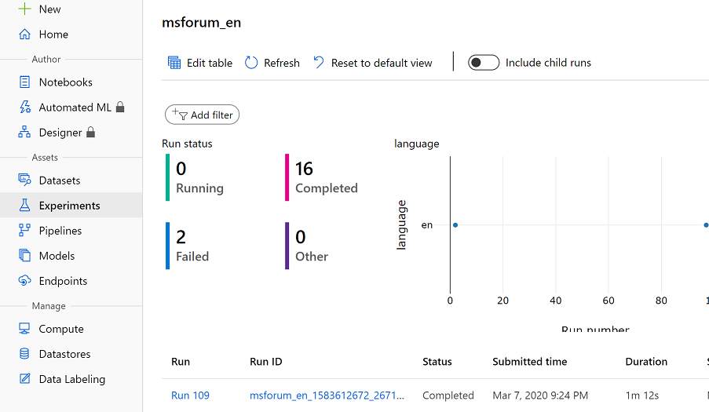
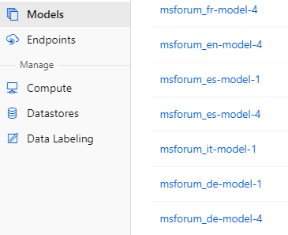

# Training of Models
This part of the documentation serves as guideline for the model training process. The tasks being submitted for training depend on which tasks you have defined in your config files and whether they require a training step.

Following steps **do** require a training step:
- Classification
- Multi-label Classification
- Question-Answering

Following steps **do not** require a training step and will just be skipped:
- Named Entity Recognition (Azure Text Analytics key required, if used. spaCy and flairNER do not require this)
- Opinion Mining (Azure Text Analytics key required, if used)

## Naming
The naming of the experiments in Azure Machine Learning is structures as below:
- `\<project name\>(-\<task\>)-\<step\>(-\<environment\>)`
  - Where step in [source, train, deploy], for data assets.
  - Where task is an int, referring to the parameters, for models.
  - Example: `msforum_en_train_1`

## Initiation of the Training Process
After setting up your projects in the previous pages, you are now ready to train your models. This training step incorporates the classification, named entity recognition and question/answering models all in one.
  1. Open your command line in VSCode, PowerShell or bash.
  2. Log in to your Azure account `az login`. If an error occurs, try `az login --use-device-code`. A browser window may open where have to log in to your Azure account for authentication purpose.
  3. Change your directory to root directory of the repository.
  4. Activate your virtual environment in case you have not yet.
  5. Following command needs to be adapted to your project language:
  ```python
  python deploy/training.py --project_name [INSERT PROJECT NAME FROM CONFIG.JSON] --do_prepare --do_train
  ```
  In case your project name is `msforum_en`, it would look as follows:
  ```python
  python deploy/training.py --project_name msforum_en --do_prepare --do_train
  ```

  6. This step might take a while, especially when executing it for the first time. Training is now running and the datasets as well as experiments are going to be registered in Azure Machine Learning.
  7. Once you see `[INFO] Task 1 deployed for training.` in the logs, the job has successfully been started. Open your experiment in Azure Machine Learning. You can also find a direct URL in the logs which is going to lead you to your experiment.

## Access your experiments in Azure Machine Learning
After running the classification training step, you will find your experiments in Azure Machine Learning.

1. Clicking on "_Experiments_" on the left side, you will find your experiment being registered with the respective name and language shortcut. In case you initiate further training rounds for the same language, they will all be registered under the same experiment. Click on the respective experiments to get insights on running an, failed and finished experiment rounds. <br><br> <br><br>

2. There, you will get a detailed view on earlier training rounds. <br><br>

3. After the training round has successfully been finished, enter the `Models` menu on the left hand side. There you will find models which successfully have been trained.<br><br>

4. For every task like classification, NER etc., a separate model is going to be registered. For example, `msforum_de-model-1` stands for a successfully trained classification model, `msforum_de-model-4` for question/answering. Depending on your pre-defined tasks, you should wait until all your models appear here before you proceed with the model deployment.

TODO:
- limitations: max characters, etc.. focus is on paragraph, not document classification