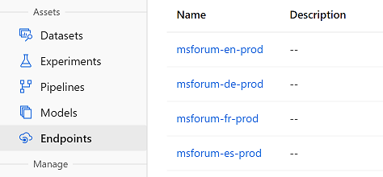

# Webservice Deployment Guide
In the following documentation, you will find a step-by-step guide on how to bring your trained models into production.


## Deployment Steps
After finishing the training rounds, your models are ready to be deployed as an endpoint. During this process, a new Azure _Azure Container Instance_ is going to be created in your resource group and it will also be registered in your Azure Machine Learning workspace. They are configured with 2GB of RAM and 1 CPU (minimum performance), but you can scale this up by changing the values in `service.py`. For demo purpose, these values are sufficient. You will initiate the deployment from the root directory of the repository using the command line. <br>
```python
(nlp) python deploy/service.py --do_deploy --project_name [YOUR PROJECT NAME]
```

The placeholder for `--project` has to be replaced with your project name as stated in your project file, such as `msforum_en`:<br>
```python
(nlp) python deploy/service.py --do_deploy --project_name msforum_en
```

The deployment may take a while. You will find the deployed models in your Azure Machine Learning workspace in the _Endpoints_-section. We recommend you to submit a test request before using the endpoints in deployments. You can do this with help of [Postman](https://www.postman.com/downloads/).

You can get your keys by clicking on the respective real-time endpoint name. In the _Consume_, you need to copy the REST Endpoint URL (e.g. http://29efd3ea-2d9d-4c54-99b0-89a099f7aa80.westeurope.azurecontainer.io/score). Further, you need to get the _Primary Key_ for your endpoint scoring (e.g. `Nm8MKM8FT8KshjtPGNfKioNxkltg3pKx`).



## Endpoint Test with Postman
Get [Postman](https://www.postman.com/downloads/) and install it on your local machine. There is a prepared example request for the English endpoint, which you can download [here](../.attachments/postman-request.json).

1. Open Postman and import the file you just downloaded by clicking on _"Import"_ and _"Import File"_.<br>


2. In the tab _"Collections"_ you will find the example request _"NLP API"_.

3. In case you want to test your own endpoint, replace the example URL `http://29efd3ea-2d9d-4c54-99b0-89a099f7aa80.westeurope.azurecontainer.io/score` with your custom one. Further, insert your authorization key in the _"Headers"_ section right after the word `Bearer` (which you have to keep).<br>


4. Switch the tab to _"Body"_ and edit the values for _"subject"_ and _"body"_.


5. Click _"Submit"_ and wait for the result, which you will find below.
.

## Batch Scoring
If you have multiple files or a whole dataset to be scored, you can find a batch scoring Jupyter notebook in the GitHub repository, located in the subfolder `notebook` as `Score - Batch Scoring of Model Endpoint.ipynb`. With that, you will be able to export your predictions as comma-separated values. Further, classification report and confusion matrix based on ScikitLearn are integrated.

[<< Previous Page](Train-QA.md)
